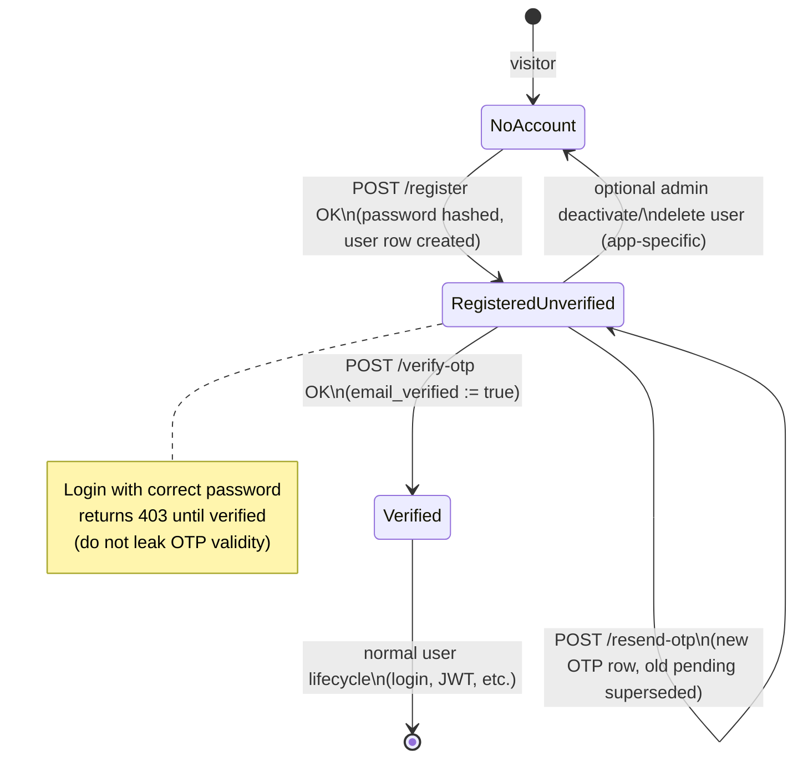
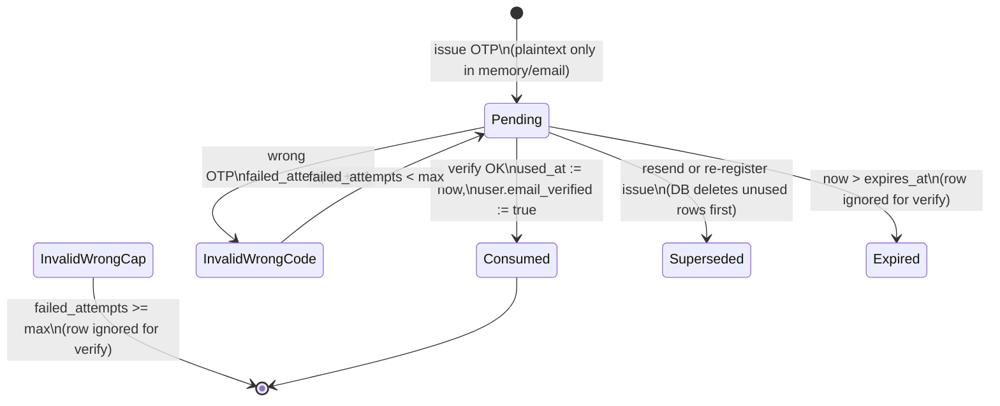
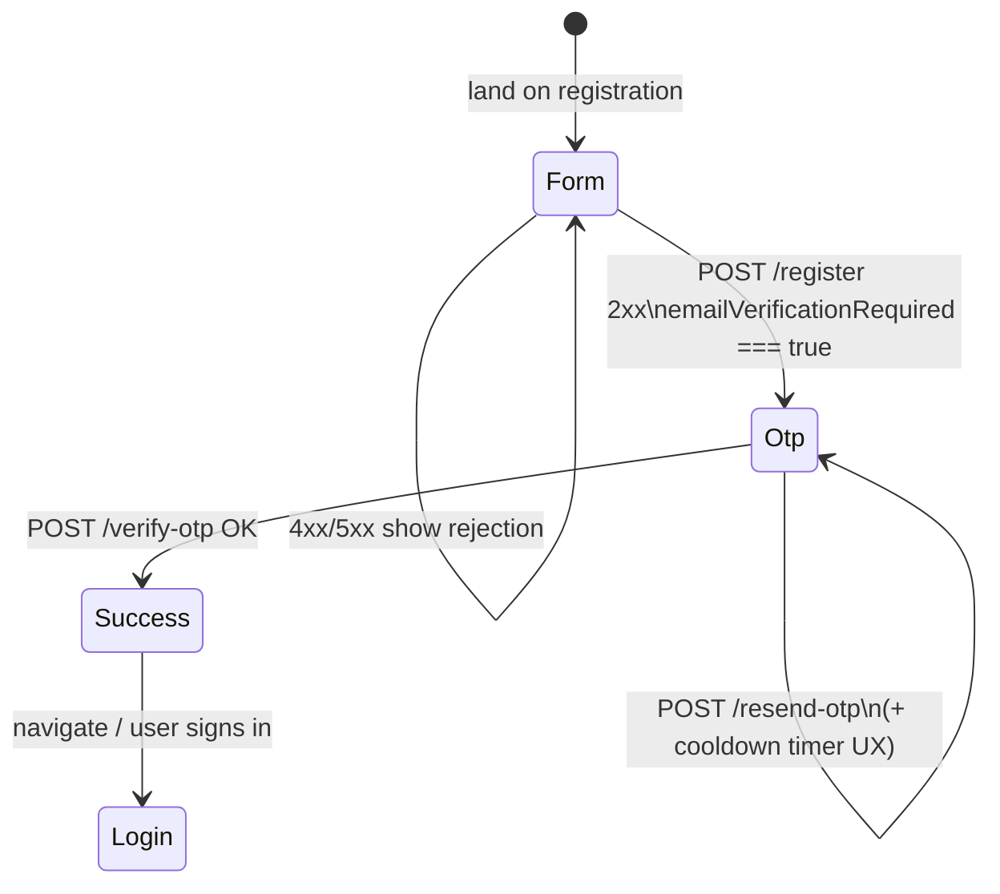

# OTP-verified registration: workflow & state machine (engineering guide)

This document describes **email OTP verification during signup** end-to-end: **frontend**, **backend**, **database**, and **when object storage (e.g. MinIO) is relevant**. It is written so another team can implement the same pattern in a **new** application; it aligns with the reference implementation in this repo (`be0/src/auth_api.py`, `be0/src/auth_mail.py`, `fe0/src/auth/registration/`, migrations `013_*` / `014_*`).

---

## 1. Goals & threat model (what we optimize for)

| Goal | How |
|------|-----|
| Prove control of the inbox before full account use | `users.email_verified = false` until OTP succeeds; **login denied** until verified. |
| Avoid storing OTP plaintext | Persist **only a hash** of the OTP (same idea as password storage). |
| Limit brute-force on OTP | Cap **failed attempts** per pending code; use **constant-time** compare on hash. |
| Limit abuse of “resend” | Rate-limit **per email** and **per IP** (see §7). |
| Avoid email enumeration on resend | Return **same JSON envelope** whether the address exists or needs OTP (reference pattern). |

**MinIO / S3:** OTP delivery does **not** use object storage. Include MinIO in your design doc **only** if registration itself uploads files (avatars, documents); keep OTP and mail independent of buckets.

---

## 2. Account-level state machine (`users`)

After successful `POST /auth/register`, the server creates an **active** user with **`email_verified = false`**. Verification flips the flag; login is allowed only when **`email_verified = true`**.

**Engineering rules:**

- **Register** must be **atomic**: create user + staff/profile as needed + insert OTP row + commit before sending email (or you risk orphan users without OTP).
- **Login** when password OK but `email_verified` is false: return **403** with a message that tells the user to complete OTP / resend (reference copy mentions OTP resend on registration flow).

---

## 3. OTP row lifecycle (`registration_otp_codes`)

Each issued OTP is one row. Only **one logical “pending”** code per user is typical: **issue** deletes previous unused rows for that user, then inserts a new row.

**Reference schema** (`014_registration_otp.sql`):

- `user_id` → `users(id)`
- `otp_hash` — never store plaintext OTP
- `expires_at` — server-side TTL (e.g. env-configurable minutes, clamped to a sane max)
- `failed_attempts` — increment on mismatch; **reject verify** when ≥ max (e.g. 5)
- `used_at` — non-null means consumed

**Verify query logic (conceptual):**

1. Resolve user by **normalized email**, active, **`email_verified` still false** — otherwise reject with **generic** error (same message as bad OTP if you want strict anti-enumeration on verify; reference uses a uniform rejection detail).
2. Select **latest** pending row where `used_at IS NULL`, `expires_at > now()`, `failed_attempts < max`.
3. Compare `hash(submitted_otp)` to `otp_hash` with **constant-time** comparison (`hmac.compare_digest` in Python).
4. On match: set `user.email_verified = true`, `row.used_at = now()`, audit log, commit.
5. On mismatch: increment `failed_attempts`, commit, reject.

---

## 4. Frontend state machine (wizard UX)

The SPA typically uses **local UI states**, not the server’s DB state diagram:

**Contract hints for engineers:**

- Read **`otpTtlSeconds`** from register response and drive countdown (stay in sync with server TTL; avoid hardcoding if backend can change TTL via env).
- **`otpDeliveryChannel`** (or equivalent): `smtp` | `log_only` | `none` | `smtp_failed` — drives toasts/help text (SMTP missing, dev log-only, SMTP error).
- **Resend UX cooldown** on the client is **supplementary**; server **must** enforce rate limits independently.
- OTP input: **exactly 6 digits** if matching this API; paste-friendly fields improve UX.

---

## 5. Backend API surface (minimal)

| Method | Path | Purpose |
|--------|------|---------|
| `POST` | `/auth/register` | Create user with `email_verified=false`; issue OTP; attempt email delivery; return `{ otpTtlSeconds, otpDeliveryChannel, emailVerificationRequired, ... }`. |
| `POST` | `/auth/verify-otp` | Body: `{ email, otp }` — normalized email + `\d{6}` OTP; on success set verified. |
| `POST` | `/auth/resend-otp` | Body: `{ email }` — enumeration-safe constant response; **429** if rate-limited. |
| `POST` | `/auth/login` | Reject **403** when password OK but email not verified (reference behavior). |

**Optional legacy path in this repo:** `POST /auth/verify-email` with **magic-link token** (`email_verification_tokens`). New apps should prefer **either** OTP **or** magic link consistently to reduce confusion.

---

## 6. Email delivery (no MinIO)

Outbound mail is **SMTP** or **dev log**:

- **Production:** `SMTP_HOST`, `SMTP_USER`, `SMTP_PASSWORD`, `SMTP_PORT`, `SMTP_USE_TLS`, `AUTH_MAIL_FROM`, optional `AUTH_PUBLIC_WEB_ORIGIN` for links in other mails.
- **Dev:** `AUTH_MAIL_LOG_ONLY=1` — log plaintext OTP (**never** enable in production).

If SMTP fails **after** user creation, return a distinct delivery channel (e.g. `smtp_failed`) so the client can explain “account created but email failed”; ops fix SMTP and user uses **resend**.

---

## 7. Rate limiting & scaling caveats

Reference implementation uses **in-process** buckets (`auth_rate_limit.py`): e.g. **5 resends per email per hour** and **30 per IP per hour** (rolling window).

**Greenfield checklist:**

- Single replica: in-memory limits are simple.
- Multiple API workers / pods: use **Redis** (or API gateway limits) for shared counters; tune limits per product policy.
- Always rate-limit **resend** harder than **verify** if verify is already capped by `failed_attempts`.

---

## 8. Database prerequisites

1. **`users.email_verified`** — `BOOLEAN NOT NULL DEFAULT FALSE` (migration `013_email_verification.sql` pattern).
2. **`registration_otp_codes`** — table as in §3 (`014_registration_otp.sql` pattern).
3. **Indexes** — partial index on pending OTP by `user_id` speeds lookup.

**MinIO:** no migration needed for OTP. Add bucket policies only if registration uploads binaries.

---

## 9. Observability & security checklist

- **Audit:** log verification success and resend with actor metadata (no OTP plaintext in audit).
- **Logs:** mail failures at `register` / `resend` with exception detail for ops; avoid logging hashed OTP.
- **HTTPS:** registration and OTP over TLS; HttpOnly cookies if using cookie-based sessions.
- **CORS:** allow credentials only for trusted front-end origins.
- **JWT:** issue tokens **after** login; do not put OTP or `email_verified=false` users into a “logged-in” state unless your product explicitly wants partial tokens (reference does not).

---

## 10. Reference file map (this repository)

| Layer | Location |
|-------|----------|
| Register / verify / resend / login gate | `be0/src/auth_api.py` |
| SMTP + `AUTH_MAIL_LOG_ONLY` | `be0/src/auth_mail.py` |
| Resend rate limits | `be0/src/auth_rate_limit.py` |
| OTP table migration | `be0/migrations/014_registration_otp.sql` |
| `email_verified` + magic-link tokens | `be0/migrations/013_email_verification.sql` |
| Registration UI + delivery UX | `fe0/src/auth/registration/RegistrationWithOtp.tsx` |
| TTL/cooldown constants (keep aligned) | `fe0/src/auth/registration/constants.ts` |
| API client | `fe0/src/lib/auth-service.ts` |

---

## 11. Summary one-liner for architects

**OTP registration is a small state machine on top of `users.email_verified` plus short-lived hashed OTP rows, sent over SMTP (not object storage), with gated login and abuse limits on resend—implement the same invariants even if frameworks differ.**
