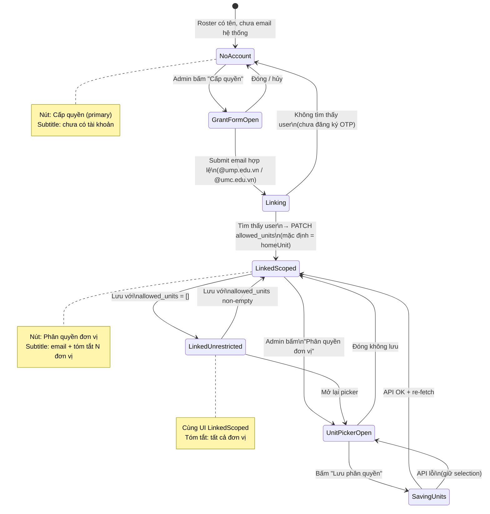
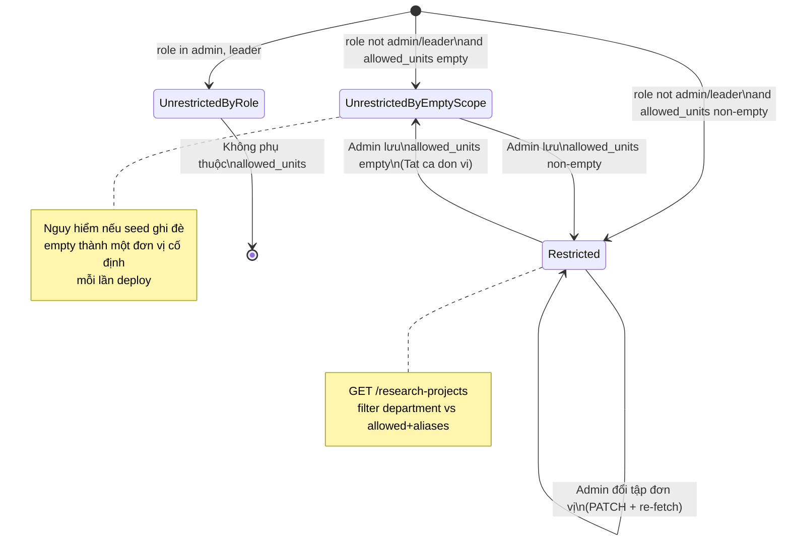
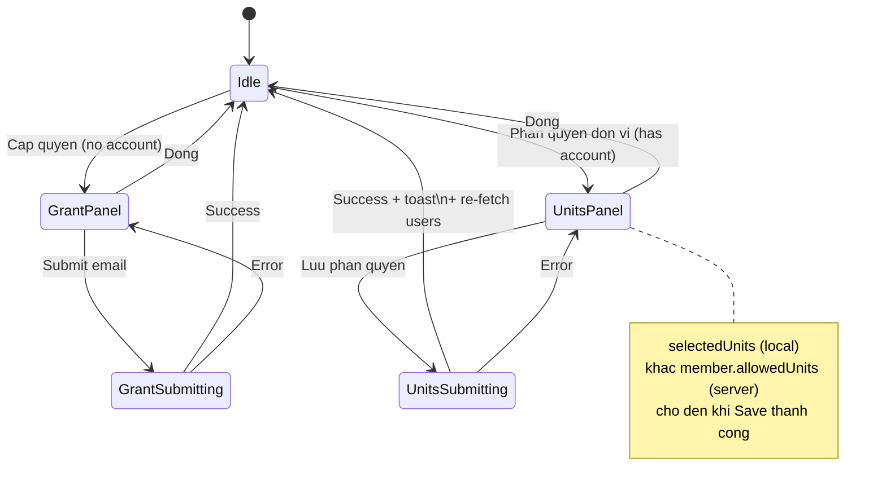
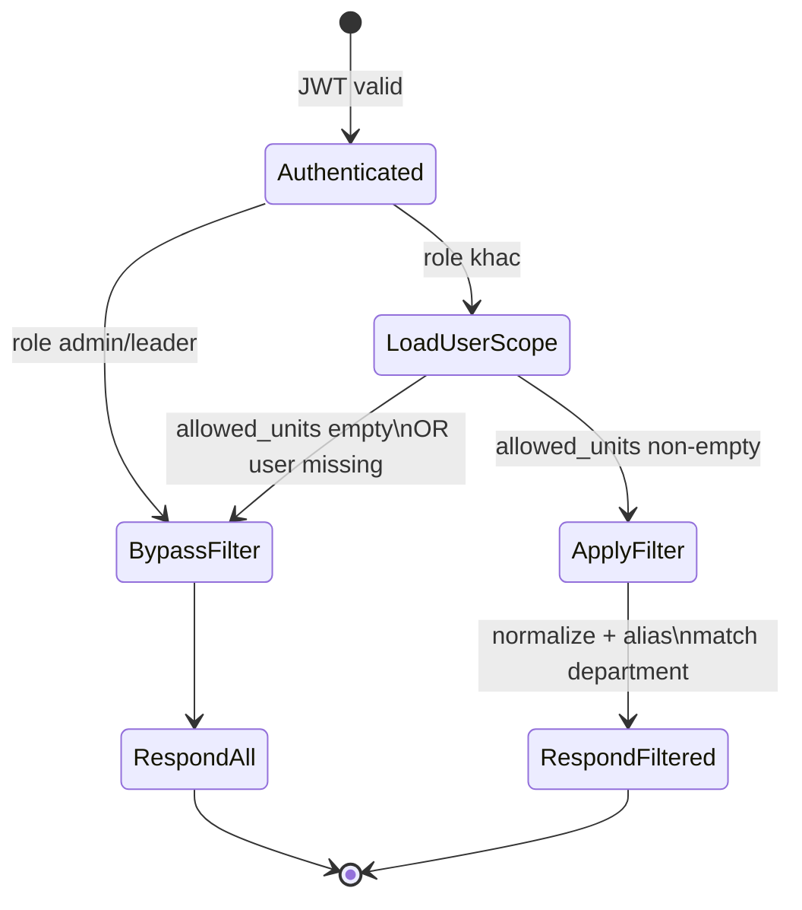
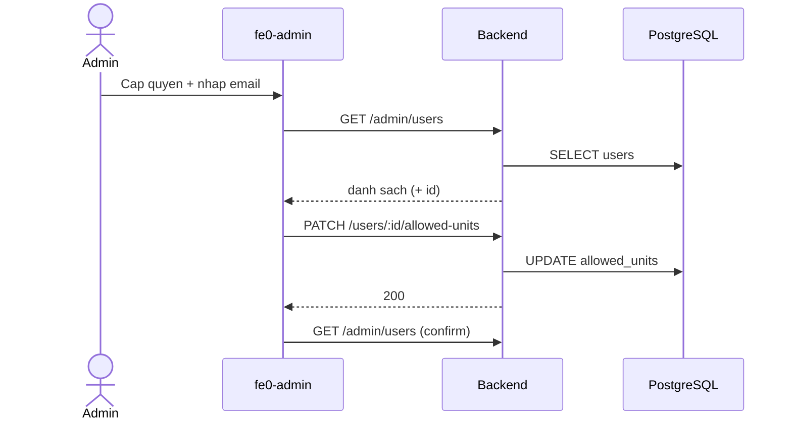
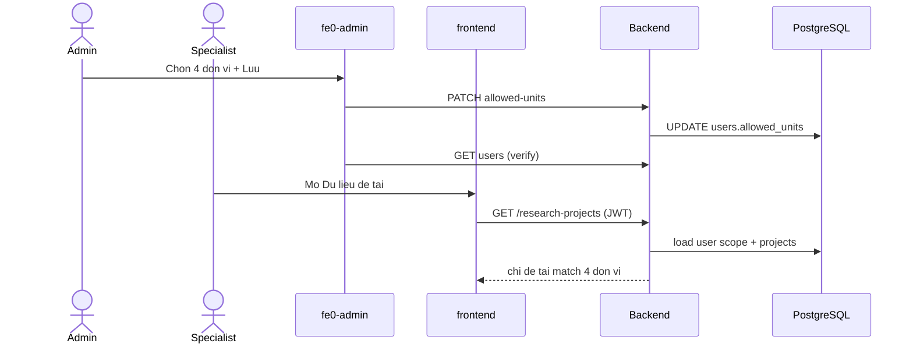

# Báo cáo kỹ thuật: Phân quyền đề tài theo đơn vị / trung tâm / khoa

> **Mục tiêu tài liệu:** Mô tả đủ rõ để kỹ sư rebuild tính năng tương tự trên app khác.  
> **Phạm vi:** Phân quyền *xem đề tài* theo phạm vi tổ chức (org-scoped read). Không bao gồm RBAC tính năng (`feature_permissions`) trừ phần liên hệ kiến trúc.  
> **Ứng dụng tham chiếu:** UMP RMS (`fe0-admin` :5174, `frontend` :5173, `backend` :3001).

---

## 1. Tóm tắt một câu

Admin gán cho mỗi tài khoản một tập **đơn vị được phép xem**; API danh sách đề tài **lọc server-side** theo trường `department` của đề tài; UI admin chỉ là mặt điều khiển — **DB là nguồn sự thật**.

---

## 2. Bài toán nghiệp vụ

| Nhu cầu | Quy tắc |
|--------|---------|
| Thành viên chưa có tài khoản | Tự đăng ký `@ump.edu.vn` / `@umc.edu.vn` (OTP). Admin **không** tạo mật khẩu. |
| Cấp quyền vào đơn vị | Admin xác nhận email đã đăng ký → liên kết member ↔ `users`. |
| Phân quyền xem đề tài | Admin chọn 0..N đơn vị / trung tâm / khoa. |
| **Bỏ trống** | = xem **tất cả** đơn vị. |
| **Có chọn** | = chỉ xem đề tài có `department` thuộc tập đã chọn (kèm alias). |
| Vai trò không bị hạn chế | `admin`, `leader` luôn thấy toàn bộ (bỏ qua `allowed_units`). |
| Vai trò bị hạn chế | `specialist`, `user` (và mọi role khác ngoài admin/leader). |

**Bài học triển khai sớm:** Chỉ cập nhật state React mà không ghi DB → cổng dữ liệu vẫn thấy full list. Enforce **bắt buộc ở API**, không tin frontend.

---

## 3. Kiến trúc tổng quan

```text
  fe0-admin (:5174)              Backend API                 PostgreSQL
  TopicPermissions               /api/v1/admin/*
         |                              |                         |
         |-- PATCH allowed_units ------>|-- UPDATE users -------->|
         |<------- GET users -----------|<-- SELECT users --------|
         |                              |                         |
  frontend (:5173)               /research-projects               |
  Du lieu de tai                        |                         |
         |-- GET list ----------------->|-- listForUser() ------->|
         |<-- filtered rows ------------|<-- projects + scope ----|
```

### 3.1 Thành phần chính

| Layer | Path | Trách nhiệm |
|-------|------|-------------|
| Admin UI | `fe0-admin/src/pages/TopicPermissionsPage.tsx` | Danh sách thành viên, cấp quyền email, chọn đơn vị, lưu API |
| Seed danh mục | `fe0-admin/src/data/unitMembers.ts` | Roster demo + nhóm đơn vị (Khoa/Phòng/Trung tâm/BV) |
| Admin API | `backend/.../admin/*` | CRUD role + `allowed_units` (chỉ `admin`) |
| List API | `backend/.../research-projects/*` | `listForUser(userId, role)` |
| Matching | `backend/.../departmentAccess.ts` | Normalize + alias + match `department` |
| Data portal | `frontend/.../usePersistedTableProjects.ts` | Gọi `getAll()` — **không** tự filter thêm |

---

## 4. Mô hình dữ liệu

### 4.1 User scope

```sql
ALTER TABLE users
  ADD COLUMN IF NOT EXISTS allowed_units TEXT[] NOT NULL DEFAULT '{}';
```

| Giá trị | Ý nghĩa |
|---------|---------|
| `'{}'` (rỗng) | Không giới hạn đơn vị → thấy tất cả đề tài *(với role bị hạn chế)* |
| `'{A,B}'` | Chỉ đề tài thuộc A hoặc B (sau normalize/alias) |

### 4.2 Project attribute

- Trường phạm vi: `research_projects.data->>'department'` (JSONB).
- Có thể nhiều đơn vị: `"A; B"` (phân tách `;`).
- Form nhập map `facultyUnits[]` → `department` join bằng `'; '`.

### 4.3 Canonical unit catalog

Danh mục checkbox admin phải **cùng tập nhãn** với giá trị `department` khi nhập liệu (hoặc có bảng alias). Ví dụ nhóm:

- Khoa / Trường
- Phòng / Đơn vị chức năng
- Trung tâm
- Bệnh viện

### 4.4 Alias (bắt buộc với dữ liệu Excel thực tế)

Import thường dùng mã ngắn (`TT YSHPT`, `Dược`) trong khi UI dùng tên đầy đủ (`Trung tâm Y sinh học phân tử`, `Trường Dược`).

```ts
// Ý tưởng: normalize(accent-strip + lower) rồi expand alias
'Trường Dược' → {'truong duoc', 'duoc'}
'Trung tâm Y sinh học phân tử' → {'trung tam y sinh hoc phan tu', 'tt yshpt'}
```

Không có alias → user “được quyền Trường Dược” nhưng DB ghi `Dược` → **thấy 0 đề tài** (trông như bug phân quyền).

---

## 5. API contract

### 5.1 Admin (requireAuth + requireRole `admin`)

| Method | Path | Body / Response |
|--------|------|-----------------|
| `GET` | `/api/v1/admin/users` | `{ users: [{ id, email, full_name, role, allowed_units, created_at }] }` |
| `PATCH` | `/api/v1/admin/users/:id/allowed-units` | `{ allowed_units: string[] }` → lưu DB |
| `PATCH` | `/api/v1/admin/users/:id/role` | `{ role }` *(RBAC vai trò, tách biệt scope đơn vị)* |

### 5.2 Data portal (requireAuth only)

| Method | Path | Hành vi |
|--------|------|---------|
| `GET` | `/api/v1/research-projects` | `listForUser(jwt.id, jwt.role)` — **đã lọc** |

**Không** nhét `allowed_units` vào JWT: admin đổi quyền → có hiệu lực ngay request kế tiếp, không cần login lại (vẫn nên refresh UI).

---

## 6. Logic lọc đề tài (pseudocode)

```text
function listForUser(userId, roleFromToken):
  all ← SELECT * FROM research_projects

  if roleFromToken ∈ {admin, leader}:
    return all

  access ← SELECT role, allowed_units FROM users WHERE id = userId
  if access is null OR access.role ∈ {admin, leader}:
    return all

  if access.allowed_units is empty:
    return all          // "bỏ trống = tất cả"

  allowed ← expandAliases(normalize(access.allowed_units))
  return all.filter(p =>
    any segment in split(p.department, ';')
      has normalize(segment) ∈ allowed
  )
```

**Nguyên tắc:** Deny by omission ở tầng dữ liệu (chỉ trả record được phép), không dựa vào ẩn cột trên UI.

---

## 7. State machines

### 7.1 Vòng đời thành viên (Member account linkage)

Trạng thái nghiệp vụ của một dòng trong “Quản lý / Phân quyền đề tài”.



#### Bảng chuyển trạng thái (member)

| State | Ý nghĩa | Sự kiện | State kế | Side effect |
|-------|---------|---------|----------|-------------|
| `NoAccount` | Chưa liên kết `users` | Mở form cấp quyền | `GrantFormOpen` | — |
| `GrantFormOpen` | Nhập email | Submit | `Linking` | Validate domain |
| `Linking` | Tra cứu user theo email | Found | `LinkedScoped` | `PATCH allowed-units` (default home) |
| `Linking` | | Not found | `NoAccount` | Báo lỗi OTP/register |
| `LinkedScoped` | Có account + scope đã gán (hoặc vừa link) | Mở picker | `UnitPickerOpen` | Load selection từ API |
| `UnitPickerOpen` | Đang chọn checkbox | Lưu | `SavingUnits` | — |
| `SavingUnits` | Đang gọi API | Success | `LinkedScoped` / `LinkedUnrestricted` | Persist + re-fetch |
| `LinkedUnrestricted` | `allowed_units = []` | — | — | API list = full |

---

### 7.2 Vòng đời quyền xem đề tài của user (Access scope)

State của **chính sách đọc** gắn với `users.allowed_units` + `role`.



#### Bảng quyết định đọc (read decision table)

| Role | `allowed_units` | Kết quả `GET /research-projects` |
|------|-----------------|----------------------------------|
| `admin` / `leader` | bất kỳ | Tất cả |
| `specialist` / `user` | `[]` | Tất cả |
| `specialist` / `user` | `[U1, U2, …]` | Chỉ đề tài match U1/U2/… (+ alias) |

---

### 7.3 State machine phiên admin UI (panel)



**Anti-pattern đã gặp:** Hiển thị “Đang chọn: 4 đơn vị” (local) trong khi DB vẫn `[YSHPT]` → portal lọc theo DB.  
**Mitigation:** Sau `PATCH`, bắt buộc `GET /admin/users` và chỉ tin `allowed_units` từ response; toast ghi rõ “đã lưu vào hệ thống”.

---

### 7.4 Request-time filter (mini state)



---

## 8. Luồng end-to-end (happy paths)

### 8.1 Cấp quyền lần đầu



### 8.2 Đổi scope → thấy đúng đề tài



---

## 9. Checklist rebuild trên app tương tự

### Bước 1 — Chọn resource attribute và subject attribute

1. Resource: field nào biểu diễn phạm vi? (ở đây: `department`)
2. Subject: lưu scope ở đâu? (ở đây: `users.allowed_units TEXT[]`)
3. Quy ước empty = all hay empty = deny? (**phải document một lần, enforce nhất quán**)

### Bước 2 — Schema + migrate idempotent

```sql
ALTER TABLE users ADD COLUMN IF NOT EXISTS allowed_units TEXT[] NOT NULL DEFAULT '{}';
```

### Bước 3 — Admin API ghi scope

- Chỉ role admin.
- Validate `allowed_units` là `string[]`.
- Trả lại giá trị đã lưu trong `GET users`.

### Bước 4 — Enforce trên mọi read API nhạy cảm

- List, export, detail, search, analytics — **cùng hàm** `listForUser` / `assertCanRead`.
- Không chỉ filter một trang UI.

### Bước 5 — Alias và normalize

- Bảng map tên đầy đủ ↔ mã ngắn / biến thể Unicode.
- So khớp sau `NFD` + bỏ dấu.

### Bước 6 — Admin UI

- Phân biệt **chưa có tài khoản** vs **đã có**.
- Local selection khác persisted scope cho đến khi Save OK.
- Sau Save: re-fetch; toast xác nhận số đơn vị **trong DB**.

### Bước 7 — Không seed ghi đè quyền

- Seed chỉ tạo user mẫu.
- **Cấm** `UPDATE ... SET allowed_units = '{X}' WHERE allowed_units = '{}'` trên mỗi deploy nếu `{}` mang nghĩa “tất cả”.

### Bước 8 — Kiểm thử chấp nhận

| Case | Kỳ vọng |
|------|---------|
| admin | Full list |
| specialist + `[]` | Full list |
| specialist + `[U]` | Chỉ đề tài department thuộc U hợp aliases(U) |
| specialist + `[U]` nhưng data dùng mã ngắn | Vẫn thấy (nhờ alias) |
| Đổi scope trên admin, F5 portal | List đổi ngay (không cần token mới) |
| Chỉ tick UI, không Save | Portal **không** đổi |

---

## 10. File tham chiếu trong repo UMP RMS

| Mục | File |
|-----|------|
| Schema cột | `backend/schema.sql` (`allowed_units`) |
| Admin routes | `backend/src/modules/admin/admin.routes.ts` |
| Admin user repo | `backend/src/modules/admin/admin-user.repository.ts` |
| Filter service | `backend/src/modules/research-projects/research-project.service.ts` |
| Normalize/alias | `backend/src/modules/research-projects/departmentAccess.ts` |
| Admin page | `fe0-admin/src/pages/TopicPermissionsPage.tsx` |
| Unit catalog | `fe0-admin/src/data/unitMembers.ts` |
| Client PATCH | `fe0-admin/src/api/userService.ts` (`updateAllowedUnits`) |
| Feature RBAC (tách biệt) | `feature_permissions` + `PermissionsPage` |

---

## 11. Phân biệt hai lớp phân quyền

```text
+----------------------------------------------+
| Lop A — Feature RBAC                         |
| feature_permissions: feature -> roles[]      |
| Vi du: project.delete chi admin              |
| UI: fe0-admin /permissions                   |
+----------------------------------------------+
+----------------------------------------------+
| Lop B — Data scope (tai lieu nay)            |
| users.allowed_units -> filter rows           |
| Vi du: specialist chi thay de tai khoa X     |
| UI: fe0-admin /topic-permissions             |
+----------------------------------------------+
```

Rebuild app khác: có thể chỉ cần **Lớp B** (row-level), hoặc cả hai. Đừng gộp checkbox “tab tính năng” với “đơn vị dữ liệu” thành một model — dễ gây hiểu nhầm nghiệp vụ (đã xảy ra khi chuyển từ tab module → org unit).

---

## 12. Tóm tắt thiết kế cho slide / onboarding

1. **Subject scope** lưu DB (`allowed_units`).
2. **Resource tag** trên mỗi record (`department`).
3. **Empty = all** (hoặc chọn empty = deny — nhưng phải một nghĩa).
4. **Role bypass** cho admin/leader.
5. **Server enforce** trên list API.
6. **Alias** cho dữ liệu bẩn / mã ngắn.
7. **Admin UI** chỉ ghi scope; sau save phải verify bằng GET.
8. **State machine** tách: liên kết tài khoản ↔ chỉnh scope ↔ filter lúc request.

Hết. Tài liệu này đủ để tái lập pipeline: *catalog đơn vị → gán scope → persist → filter đọc → kiểm thử chấp nhận*.
